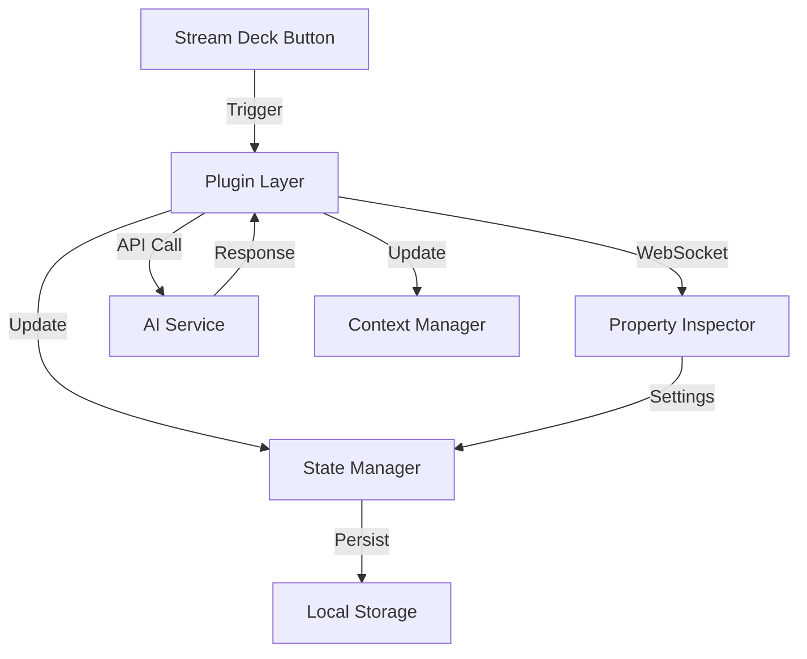

# Technical Specification

## Architecture Overview

### Core Components

1. **Plugin Layer**
   - Event handling for Stream Deck interactions
   - WebSocket communication management
   - AI service integration
   - State persistence
   - Context management

2. **Property Inspector (UI Layer)**
   - Template configuration interface
   - Settings management
   - Real-time feedback display
   - Context visualization

### Communication Flow



### State Management

1. **Local Storage**
   - Prompt templates
   - Configuration settings
   - Context history
   - Action mappings

2. **Runtime State**
   - Active context
   - Current session
   - Response cache
   - Error states

### Event System

1. **Input Events**
   - Button press
   - Long press
   - Multi-action trigger
   - Settings change

2. **Output Events**
   - UI updates
   - State changes
   - Context switches
   - Error notifications

## Implementation Details

### Plugin Structure

```javascript
class AIDevPlugin {
    constructor() {
        this.contextManager = new ContextManager();
        this.stateManager = new StateManager();
        this.templateManager = new TemplateManager();
        this.wsClient = new WebSocketClient();
    }

    // Event Handlers
    onKeyDown(context, settings, coordinates, userDesiredState) {}
    onKeyUp(context, settings, coordinates, userDesiredState) {}
    onWillAppear(context, settings, coordinates) {}
    
    // State Management
    updateState(newState) {}
    persistContext(context) {}
    
    // Template Management
    loadTemplate(templateId) {}
    executeTemplate(template, context) {}
}
```

### Property Inspector Components

1. **Template Editor**
   - Syntax highlighting
   - Variable management
   - Context linking
   - Preview functionality

2. **Settings Panel**
   - API configuration
   - Default values
   - Color schemes
   - Behavior settings

3. **Context Viewer**
   - Active context display
   - History browser
   - State inspector
   - Debug information

## Development Workflow

### Setup Process

1. Initialize plugin structure
2. Set up WebSocket handlers
3. Implement state management
4. Create basic UI components
5. Add template management
6. Integrate AI services

### Testing Strategy

1. **Unit Tests**
   - Event handlers
   - State management
   - Template processing
   - Context handling

2. **Integration Tests**
   - WebSocket communication
   - AI service integration
   - State persistence
   - UI interactions

### Deployment Process

1. Build plugin package
2. Validate dependencies
3. Create distribution
4. Handle updates
